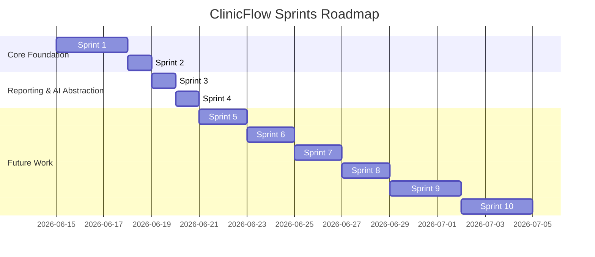

# ClinicFlow Vet OS - Sprints & Product Roadmap

This document outlines the roadmap and development plan for ClinicFlow, mapping out completed, active, and future sprints.

---

## Sprint History & Active Sprints

---

## Detailed Sprint Specifications

### Sprint 1: Patient Experience (Completed)
- **Primary Goal**: Open Patient -> See Everything (Patient 360 Workspace).
- **Features Delivered**:
  - Persistent patient summary header (Photo, breed, species, gender, age, owner, alerts).
  - Notebook tabs: Profile, Medical History, Visits, Vaccinations, Prescriptions, Hospitalizations, Billing, Documents, and Timeline.
  - Chronological timeline activity aggregation.

### Sprint 2: Operations & Integration (Completed)
- **Primary Goal**: Patient -> Treatment -> Invoice (Single Unified Workflow).
- **Features Delivered**:
  - Calendar event integration with status controls (`scheduled`, `confirmed`, `checked_in`, `no_show`, `completed`, `cancelled`).
  - Checking in an appointment automatically instantiates a SOAP visit and redirects.
  - Patient header quick action buttons (`+ New Visit`, `+ New Appointment`, etc.).
  - Prominent safety warning banners for allergies and medical alerts.
  - User-specific "Recent Patients" list in the sidebar.
  - Singleton dynamic KPI dashboards.

### Sprint 3: Documents & Reporting (Completed)
- **Primary Goal**: Management visibility, auditing, and outstanding balances.
- **Features Delivered**:
  - **Reports Sidebar**: Added a dedicated top-level sidebar menu grouping management analytics.
  - **Vaccinations Due**: Exposing overdue/scheduled vaccine lists with Odoo pivot/graph analytics for proactive scheduling.
  - **Outstanding Balances**: List view tracking unpaid posted customer invoices linked to pets, indicating owner, pet, amount due, and days overdue.
  - **Daily Activity Summary**: Dynamic reporting including completed visits, no-shows, revenue, and hospitalization counts.
  - **Patient Quick Search**: Stored computed columns (`last_visit_date`, `last_weight`, `outstanding_balance`, `upcoming_appointment_date`) on `clinicflow.pet` allowing high-performance searching, sorting, and filtering without performance degradation.
  - **Export Support**: Full integration with Odoo list-to-XLSX exports.

### Sprint 4: AI Abstraction Layer (Completed)
- **Primary Goal**: Future-proof, modular Clinical Intelligence Framework.
- **Features Delivered**:
  - **`clinicflow_ai` Addon**: A decoupled module separating business logic from AI functions.
  - **Swappable Provider Abstraction**: A base provider interface with a service model (`clinicflow.ai.service`) routing requests dynamically based on Odoo config parameter `clinicflow_ai.provider_type` (`mock`, `gemini`, `claude`, `openai`).
  - **Decoupled Prompts**: Prompts stored in Markdown files under `/prompts/` (`soap.md`, `discharge.md`, `owner_instructions.md`, `referral.md`) for code-free clinician adjustments.
  - **AI Charting & Auditing Trail**: Custom model `clinicflow.ai.audit` recording prompt/response hash, tokens, cost, provider type, and clinician edit history.
  - **Write Protection**: Prevented AI note generation from overwriting existing clinical SOAP records if any text is present.

---

## Future Backlog (Sprints 5–10)

### Sprint 5: Owner 360 & Advanced Billing (Active)
- **Goal**: Holistic contact management.
- - Unified owner dashboard displaying total pets owned, outstanding balance aggregates, appointment history across pets, and communications.

### Sprint 6: Vaccination & Outreach Campaigns (Future)
- **Goal**: Automated clinic reminders.
- - WhatsApp, SMS, and Email outreach templates linked to Vaccinations Due list.

### Sprint 7: Document Management & Imaging (Future)
- **Goal**: Rich medical diagnostics and scans.
- - Document folder tree integrations for lab results, imaging scans, and referral PDF storage.

### Sprint 8: Voice Dictation & Speech-to-SOAP (Future)
- **Goal**: Transcription-driven medical charting.
- - Record voice notes directly inside Odoo, auto-transcribe, and feed transcript to the AI Abstraction layer to map details to SOAP fields.

### Sprint 9: Client Portal (Future)
- **Goal**: Owner self-service.
- - Portal allowing owners to download vaccine certificates, review unpaid bills, and request appointments.

### Sprint 10: Migration Utilities & Importers (Future)
- **Goal**: Zero-downtime customer boarding.
- - Dedicated `clinicflow_migration` module supplying CSV/API import wizards mapped to DaySmart Vet's database exports (Owners, Pets, Visits, Invoices, Vaccinations).