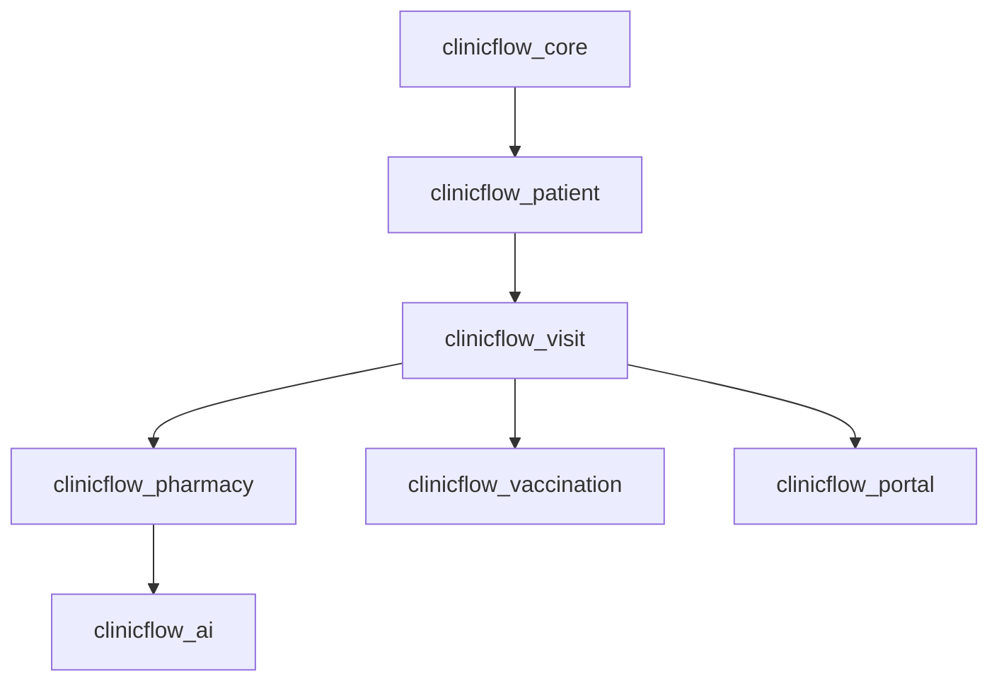
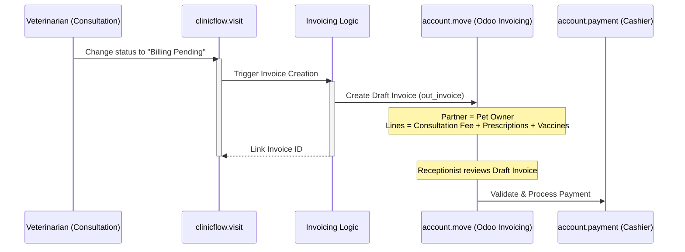
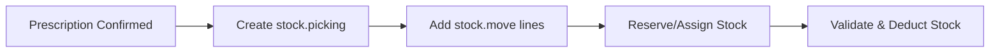
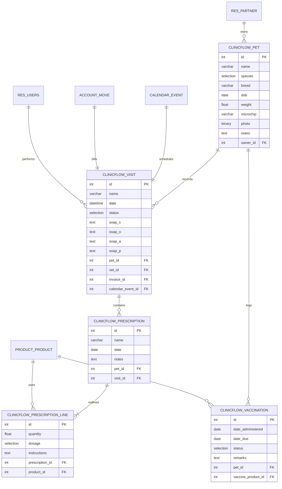

# Architecture Review & Design Specification
## ClinicFlow Vet OS on Odoo 19

**Prepared For**: Veterinary Practice Management System (PMS) Implementation  
**Author**: Ali Raza (https://github.com/amrshah/), Company: VexterSoft/Silver Ant Marketing  
**Date**: 2026-06-19  

---

## 1. Custom Models vs. Native Odoo Duplication Review

A key pitfall of Odoo custom development is duplicating functional elements already handled by Odoo's core. We evaluate the models inside `clinicflow_core` below:

| Custom Model | Purpose | Native Odoo Candidate | Duplication Status & Recommendation |
| :--- | :--- | :--- | :--- |
| `clinicflow.pet` | Master patient profiles | None (N/A) | **No Duplication**: Pets require specific medical fields (species, breed, microchip, weight history). Using `res.partner` directly for pets would pollute contacts. Keep as custom model, linking to `res.partner` for owners. |
| `clinicflow.visit` | Consultation SOAP notes & visit workflow | `calendar.event` | **Partial Duplication**: Creating a separate calendar for visits misses out on Odoo's calendar view, synchronization, and reminders. **Recommendation**: Link `clinicflow.visit` to `calendar.event` via a Many2one field, or inherit `calendar.event` directly to leverage Odoo's scheduling engine. |
| `clinicflow.prescription` | Clinical prescriptions | `sale.order` | **No Duplication (with conditions)**: Prescriptions contain medical dosing instructions (`1-0-1`, etc.) not native to Sales. Keep clinical prescriptions as custom, but design them to generate `sale.order` or `account.move` lines for billing instead of writing billing logic inside prescriptions. |
| `clinicflow.vaccination` | Vaccination history | `stock.lot` / `product.product` | **No Duplication**: Vaccination represents a medical transaction (administered date, due date). Keep custom, referencing `product.product` (the vaccine) and standard contacts. |

---

## 2. Recommended Addon Decomposition Strategy

To maintain clean dependencies, easy code upgrades, and modular deployments, we recommend decomposing `clinicflow_core` into the following sub-modules:



### Addon Directory Structure & Responsibilities

1. **`clinicflow_core`**
   - **Responsibility**: Global configurations, access groups (Veterinarians, Vet Assistants, Receptionists), sequence generators, and base security rules.
   - **Dependencies**: `base`, `contacts`

2. **`clinicflow_patient`**
   - **Responsibility**: Handles patient records (`clinicflow.pet`) and extends `res.partner` with pet-owner attributes.
   - **Dependencies**: `clinicflow_core`

3. **`clinicflow_visit`**
   - **Responsibility**: Manages the consultation flow and SOAP notes (`clinicflow.visit`). Extends Odoo's native Calendar (`calendar.event`) to link appointments directly to patient records.
   - **Dependencies**: `clinicflow_patient`, `calendar`

4. **`clinicflow_pharmacy`**
   - **Responsibility**: Manages prescriptions, doses, and links directly to Odoo Products. Handles controlled substance checkouts.
   - **Dependencies**: `clinicflow_visit`, `stock`, `purchase`

5. **`clinicflow_vaccination`**
   - **Responsibility**: Manages vaccine logs, tracks immunization histories, and generates "Next Due Date" reminders.
   - **Dependencies**: `clinicflow_visit`

6. **`clinicflow_ai`**
   - **Responsibility**: Contains logic to communicate with external AI microservices (Gemini/Claude) for voice dictation transcription and automated SOAP drafting.
   - **Dependencies**: `clinicflow_visit`

7. **`clinicflow_portal`**
   - **Responsibility**: Extends Odoo's frontend Portal controller to let pet owners view their pet records, medical history, vaccination certificates, and invoices.
   - **Dependencies**: `clinicflow_patient`, `portal`, `website`

---

## 3. Integration Designs

### A. Invoice Generation Flow (Native Odoo Accounting)

Instead of building custom invoice entities, ClinicFlow must generate draft `account.move` records directly.



#### Code Snippet Blueprint:
```python
class ClinicFlowVisit(models.Model):
    _inherit = 'clinicflow.visit'

    def action_create_invoice(self):
        self.ensure_one()
        if self.invoice_id:
            return self.invoice_id

        invoice_vals = {
            'move_type': 'out_invoice',
            'partner_id': self.owner_id.id,
            'invoice_date': fields.Date.today(),
            'invoice_line_ids': [],
        }

        # 1. Add Consultation Fee line
        consultation_product = self.env.ref('clinicflow_core.product_consultation_fee')
        invoice_vals['invoice_line_ids'].append((0, 0, {
            'product_id': consultation_product.id,
            'name': 'Veterinary Consultation Fee',
            'quantity': 1,
            'price_unit': consultation_product.list_price,
        }))

        # 2. Append prescribed medicines
        for prescription in self.prescription_ids:
            for line in prescription.line_ids:
                invoice_vals['invoice_line_ids'].append((0, 0, {
                    'product_id': line.product_id.id,
                    'quantity': line.quantity,
                    'price_unit': line.product_id.list_price,
                }))

        # 3. Create Odoo Invoice
        invoice = self.env['account.move'].create(invoice_vals)
        self.invoice_id = invoice.id
        return invoice
```

---

### B. Inventory Deduction Flow (Native Odoo Stock)

To deduct stock from the pharmacy accurately (without triggering manual database overrides), we utilize Odoo’s `stock.picking` model.



1. **Trigger**: The visit transitions to `'treatment'` or the prescription is confirmed.
2. **Action**: Create a `stock.picking` record:
   - **Picking Type**: `delivery` or `internal` transfer.
   - **Source Location**: `Virtual Locations/Customer` or custom `Pharmacy Stock` location.
   - **Destination Location**: `Virtual Locations/Output` (consumed).
3. **Move Lines**: For each prescription line, add a `stock.move` record with the matching `product_id` and `quantity`.
4. **Validation**: Call standard Odoo methods (`action_confirm()`, `action_assign()`, `button_validate()`) to automatically update stock quantities, recompute stock valuations, and log audit trails.

---

## 4. Complete Model Relationship Diagram

Below is the complete database schema diagram for ClinicFlow Vet OS, illustrating relationships between our custom modules and native Odoo models:


